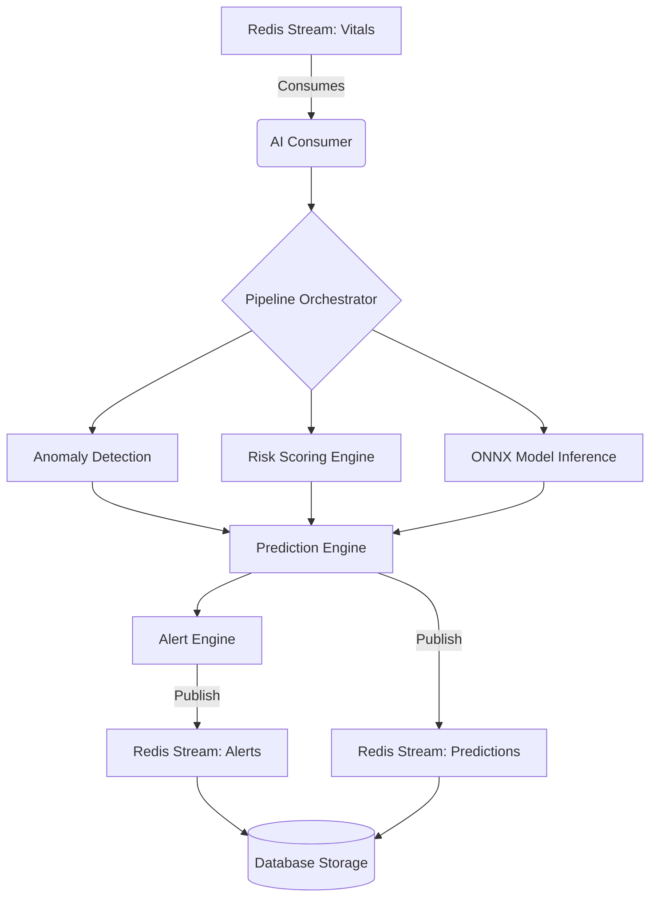

# HELIOS OS + SEVRA AI
## AI Service Architecture

### Folder Structure & Responsibilities (Section 1)

| Folder | Responsibility |
|---|---|
| `models/` | Stores serialized ONNX model files (.onnx), metadata, and scaler objects. |
| `inference/` | The core ONNX Runtime execution engine. Handles tensor conversions and batching. |
| `consumers/` | Redis Stream consumers listening for `VitalEvent` to trigger real-time inference. |
| `risk_scoring/` | Rules-based and statistical clinical priority scoring (MEWS, NEWS). |
| `anomaly_detection/` | Detection of vital sign deviations (Statistical, Z-Score, Isolation Forests). |
| `prediction_engine/` | Aggregates inference, risk, and anomaly outputs into unified clinical predictions. |
| `services/` | Business logic orchestrating the pipeline. |
| `schemas/` | Pydantic validation for internal inference flows and Redis payloads. |
| `metrics/` | Prometheus metrics tracking inference latency, model drift, and throughput. |
| `health/` | Probes verifying ONNX runtime stability and model availability. |

---

### AI Architecture Diagrams (Section 11)

#### 1. Data Flow & Inference Flow Diagram

