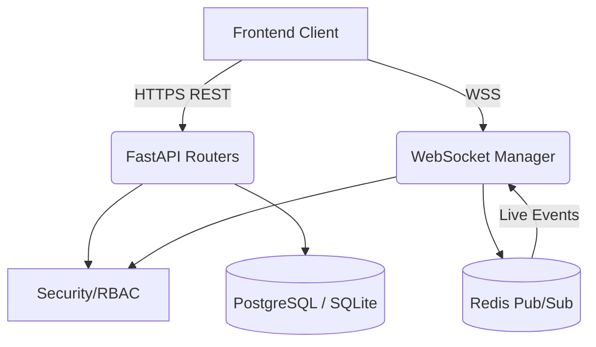
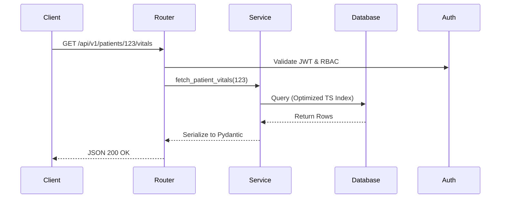
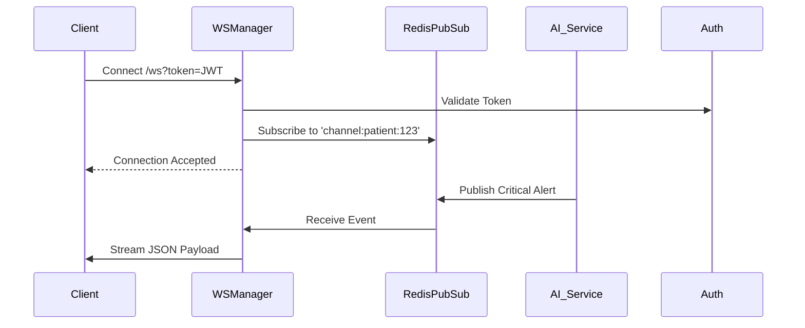

# HELIOS OS + SEVRA AI
## Dashboard Service Architecture

### Folder Structure & Responsibilities (Section 1)

| Folder | Responsibility |
|---|---|
| `api/` | Main FastAPI application factory, global middleware (CORS, Auth), and exception handlers. |
| `routers/` | FastAPI route definitions grouped by domain (`patients.py`, `vitals.py`, `alerts.py`). |
| `services/` | Business logic bridging routers to database repositories. |
| `websocket/` | Real-time connection manager, channel multiplexing (Pub/Sub via Redis), and live data emitters. |
| `schemas/` | Pydantic models for request validation and response serialization. |
| `repositories/` | (Reused or wrapped from `database` service) Data access layer. |
| `metrics/` | Prometheus metrics definitions for API latency and WebSocket concurrent connections. |
| `health/` | Kubernetes readiness/liveness probes. |
| `tests/` | Pytest suite with `TestClient` for APIs and WebSockets. |

---

### Dashboard Architecture Diagrams (Section 2)

#### 1. Architecture Diagram

#### 2. Request Flow Diagram

#### 3. WebSocket Flow Diagram

