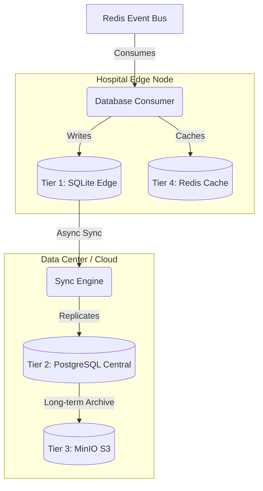
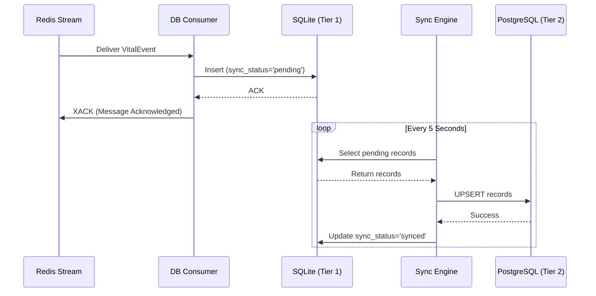
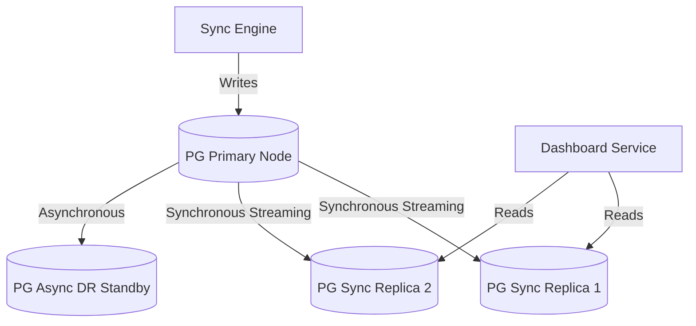
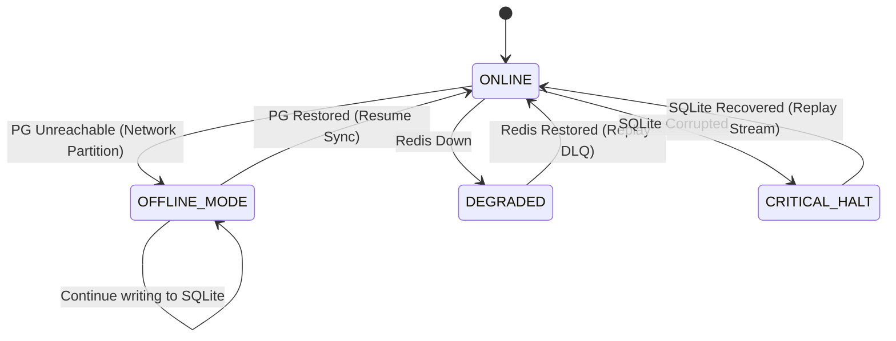

# HELIOS OS + SEVRA AI
## Database Service Architecture & Strategies

### Storage Architecture Diagrams (Section 2)

#### 1. Architecture Diagram

#### 2. Storage Flow Diagram (Offline-First)

#### 3. Replication Diagram (PostgreSQL)

#### 4. Failure Recovery Diagram

---

### PostgreSQL Backup and Recovery Strategy (Section 10)

**Backup Strategy:**
1. **Continuous Archiving (WAL):** Write-Ahead Logs are continuously archived to MinIO (Tier 3) using `pgBackRest` or `WAL-G`. This enables Point-In-Time Recovery (PITR).
2. **Daily Full Backups:** A full snapshot of the PostgreSQL database is taken daily during low-traffic windows and pushed to cold object storage.
3. **Retention:** WAL logs kept for 30 days. Full backups kept for 1 year in standard tier, then moved to Glacier equivalent.

**Recovery Strategy:**
1. **Minor Failure (Primary crashes):** Automated failover via `Patroni`. A synchronous replica is promoted to primary within 30 seconds. No data loss.
2. **Major Failure (Datacenter loss):** Failover to the asynchronous Disaster Recovery (DR) Standby node.
3. **Logical Corruption (e.g., accidental table drop):** Restore from daily full backup + replay WAL logs via PITR up to the second before the catastrophic query executed.

---

### Migrations Strategy (Section 16)
- **Tooling:** Alembic for PostgreSQL (Central DB). Raw SQL scripts or Alembic for SQLite (Edge).
- **Versioning Strategy:** Linear timeline. Scripts use semantic timestamps (e.g., `20260617_01_init`).
- **Rollback Strategy:** Every `upgrade()` must have a corresponding `downgrade()`. In production, rolling back requires an explicit CLI command and audit log entry.
