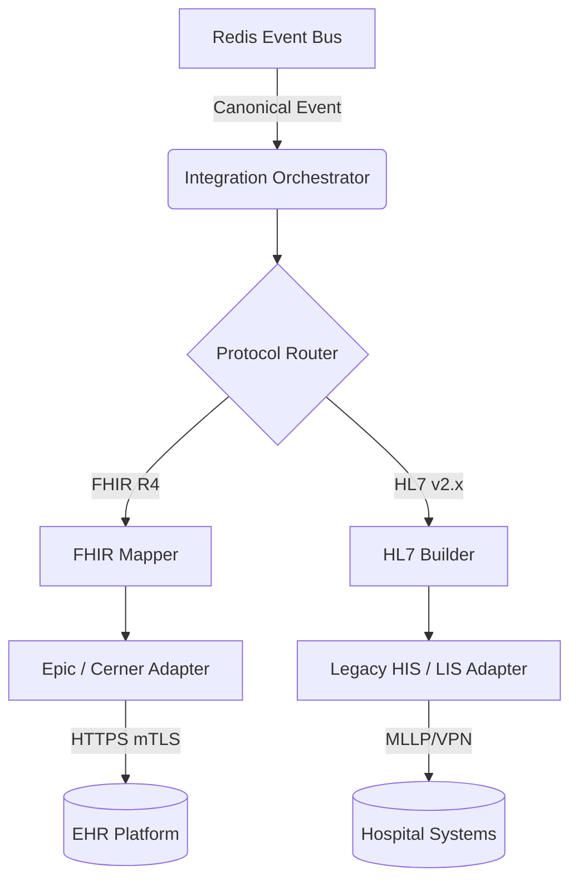
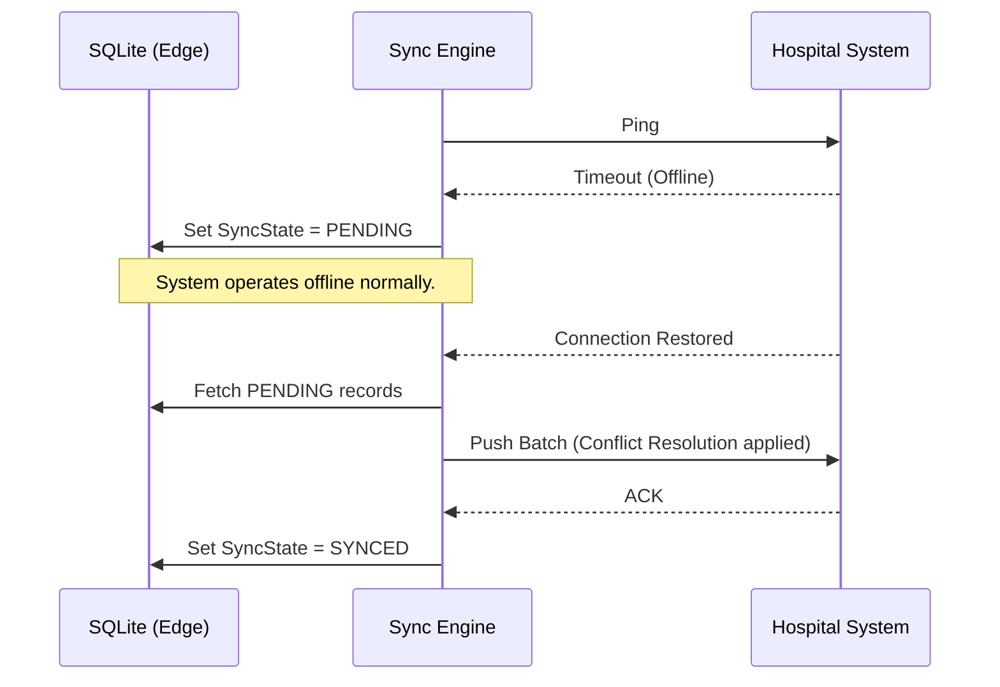

# HELIOS OS + SEVRA AI
## Hospital Integration Architecture

### Folder Structure & Responsibilities (Section 1)

| Folder | Responsibility |
|---|---|
| `fhir/` | Pydantic models for FHIR R4 resources, validation, serialization. |
| `hl7/` | Parsers and routers for HL7 v2.x (ADT, ORU) messages via MLLP or API. |
| `sync/` | Bidirectional synchronization engine (Database <-> EHR) with conflict resolution. |
| `mappings/` | Transformation rules from internal Canonical Events to FHIR/HL7 structures. |
| `adapters/` | Vendor-specific clients (Epic, Cerner, Generic) mapping to their specific APIs. |
| `validators/` | Schema validation for outgoing/incoming healthcare payloads. |
| `repositories/` | Local sync state, audit logs, and mapping references storage. |
| `services/` | Business orchestration bridging Event Bus to External Systems. |
| `health/` | EHR connection status monitoring and Circuit Breakers. |
| `metrics/` | Prometheus instrumentation for sync success, latency, and FHIR throughput. |

---

### Hospital Integration Diagrams (Section 2)

#### 1. Architecture Diagram

#### 2. Offline Sync Diagram

