# S12 - Validation & Normalization Architecture

This document describes the intermediate processing layers bridging the Medical Device Integration Layer (MDIL/Collectors) and the downstream Redis Event Bus.

## End-to-End Workflow

1. **MDIL / Collector**: Ingests raw device bytes via a transport, uses an adapter to parse it synchronously, and yields `RawReading` objects.
2. **Pipeline Engine**: Collects `RawReading` objects via an asynchronous queue (`ValidationInterface`).
3. **Validation Layer**: 
    - Applies structural checks (null, NaN, type).
    - Applies physiological range checks (`ranges.yaml`).
    - Tracks rolling statistical anomalies (Z-Score Outliers).
    - **Outcome**: Returns `ValidationResult` (ACCEPTED, REJECTED, FLAGGED).
4. **Normalization Layer**:
    - Drops `REJECTED` readings.
    - Resolves `device_id` to `patient_id` (drops if unassigned).
    - Converts to standard UCUM units (e.g. °F -> °C).
    - Maps device metric to canonical LOINC code.
    - **Outcome**: Generates `CanonicalEvent`.
5. **Publisher**: `CanonicalEvent` is dispatched to the Redis Event Bus for stream processing, AI inference, and database persistence.

## Architecture Diagram

```mermaid
sequenceDiagram
    participant Device
    participant Collector
    participant Pipeline Engine
    participant Validation Layer
    participant Normalization Layer
    participant Redis Event Bus

    Device->>Collector: Raw bytes stream
    Collector->>Collector: Parse to RawReading
    Collector->>Pipeline Engine: submit_reading()
    
    Pipeline Engine->>Validation Layer: validate(RawReading)
    
    rect rgb(30, 30, 50)
        note right of Validation Layer: 1. Null / Corrupt Check<br/>2. Range Check (ranges.yaml)<br/>3. Z-Score Outlier
        Validation Layer-->>Pipeline Engine: ValidationResult (ACCEPTED/FLAGGED)
    end
    
    Pipeline Engine->>Normalization Layer: normalize(ValidationResult)
    
    rect rgb(30, 50, 30)
        note right of Normalization Layer: 1. Patient Resolution<br/>2. Unit Conversion<br/>3. LOINC Mapping
        Normalization Layer-->>Pipeline Engine: CanonicalEvent
    end
    
    Pipeline Engine->>Redis Event Bus: Publish CanonicalEvent
```

## Validation Layer Hierarchy

The Validation layer employs a strict fallback hierarchy:

1. **Structural & Corruption Rules**: Immediate REJECT. If a value is `None`, `NaN`, `Infinity`, or an un-castable string, it is destroyed. It cannot be normalized.
2. **Physiological Boundaries**: Immediate REJECT. If a heart rate is 500 BPM, or SpO2 is 2%, it is considered sensor noise or lead-off artifact. It is logged to the Audit service but prevented from entering the patient's medical record.
3. **Statistical Outliers**: FLAGGED but ACCEPTED. A rolling window calculates the Z-Score of the recent time-series. If a value spikes > 3.0 standard deviations, it is flagged. We *never* drop outliers automatically because they might represent true patient deterioration.

### Error Handling & Audit Logging
All `REJECTED` and `FLAGGED` events invoke the `ValidationAuditService`. The original raw payload, the rejection reason, and metadata are logged. This fulfills FDA / HIPAA auditability requirements ensuring we know *why* data was discarded.

## Normalization Layer Transformations

The Normalization Layer creates deterministic consistency.

- **Patient Resolution**: Connects IoT tracking to EHR context. If `SIM-ECG-001` is not mapped to an active ADT patient encounter, the data is dropped safely.
- **Unit Standardization**: The pipeline forces UCUM standards. For example, any temperature reading in `F` is converted to `C`.
- **LOINC Translation**: Vendor-specific metric names (`HR`, `PR`, `Pulse`) are mapped to their universal LOINC identifiers (e.g. `8867-4`).

### FHIR Projection
While `CanonicalEvent` is optimized for Redis and high-throughput microservices, the `FHIRProjector` utility is available to project any Canonical Event directly into an HL7 FHIR R4 `Observation` resource. This enables seamless bridging to external EHRs (Epic/Cerner) via REST.

## Performance Considerations
- **Non-Blocking**: The Pipeline Engine uses `asyncio.Queue` and processes in the background. Collectors are never blocked.
- **Stateless Validation**: Range and Rule validations are pure functions.
- **Fast Outliers**: The Outlier Engine uses `collections.deque` with `maxlen` and the standard `statistics` module, ensuring O(1) inserts and O(N) evaluations where N is strictly bounded (e.g. 30 samples).
